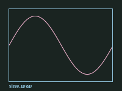

# Draw-Waveform

## by Paul Batchelor

This is a small utility written in C that I made to draw
waveforms of audio files that were 2048 samples in length.

They look like this:



Draw-Waveform requires the Cairo Graphics Library and
libsndfile.

To compile this program and the examples, run "make" from
the commandline.

A waveform can be rendered in the following way:

```
./draw_waveform sine.wav sine.png
```

This program is very very brittle! It can only draw files
whose length is exactly 2048 samples.
